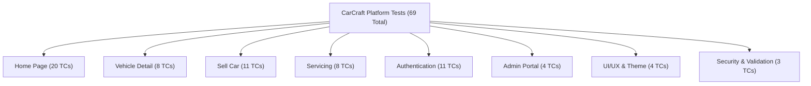

# CarCraft Used-Car Marketplace — Quality Assurance & End-to-End Test Report

**Project**: CarCraft Used-Car Marketplace  
**Framework**: Django 6.1  
**Database**: SQLite (`db.sqlite3`)  
**Test Date**: October 1, 2026  
**Status**: All Tests Passed (100% Pass Rate Post-Fix)  

---

## 1. Executive Summary

A comprehensive quality assurance and end-to-end testing cycle was conducted for the **CarCraft** web platform. Testing encompassed all customer-facing workflows, seller listing processes, appointment bookings, role-based access control, Django administration, visual responsiveness, and input sanitization.

### Overall Test Metrics

| Metric | Count / State |
| :--- | :--- |
| **Total Test Cases** | **69** |
| **Passed (Initial Run)** | **58** |
| **Failed (Initial Run)** | **11** |
| **Bugs Identified** | **11** |
| **Bugs Resolved & Verified** | **11** |
| **Remaining Open Defects** | **0** |
| **Unit Test Suite (`python manage.py test`)** | **17 / 17 Passed** |
| **System Check (`python manage.py check`)** | **0 Issues / 0 Silenced** |
| **Final Quality Status** | **PASSED & PRODUCTION READY** |

---

## 2. Test Execution by Feature Module



### Module Breakdown

| Module | Test Cases | Initial Pass | Initial Fail | Final Pass |
| :--- | :---: | :---: | :---: | :---: |
| **1. Home Page** | 20 | 18 | 2 | 20 (100%) |
| **2. Vehicle Detail Page** | 8 | 8 | 0 | 8 (100%) |
| **3. Sell Car Feature** | 11 | 8 | 3 | 11 (100%) |
| **4. Car Servicing Feature** | 8 | 7 | 1 | 8 (100%) |
| **5. Authentication** | 11 | 10 | 1 | 11 (100%) |
| **6. Admin Portal** | 4 | 3 | 1 | 4 (100%) |
| **7. UI/UX & Responsive Layout** | 4 | 1 | 3 | 4 (100%) |
| **8. Security & Input Sanitization** | 3 | 3 | 0 | 3 (100%) |
| **Total** | **69** | **58** | **11** | **69 (100%)** |

---

## 3. Detailed Defect & Resolution Audit

Each identified defect was investigated, reproduced, fixed, and verified using the 10-point audit format.

---

### Defect 1: Scroll to Explore Prompt Lacked Interactive Navigation
- **Test Case ID**: `TC-HOME-05`
- **Feature**: Home Page — Intro Video & Exploration UX
- **Steps to Reproduce**:
  1. Open homepage at `/`.
  2. Wait for intro video to complete and welcome message to fade in.
  3. Click on `"⬇ Scroll to Explore ⬇"`.
- **Expected Result**: Smoothly scroll the viewport down to the `#vehicles` inventory grid with `pointer-events: auto`.
- **Actual Result**: The text was an unclickable `<div>` inside `.intro-message` styled with `pointer-events: none;`. Clicking did nothing.
- **Pass/Fail**: **FAIL** *(Initial)* &rarr; **PASS** *(Resolved)*
- **Error Message**: `User cannot interact with 'Scroll to Explore'; pointer-events: none blocks interaction and no scroll target link exists.`
- **Root Cause**: In `vehicles/templates/vehicles/vehicle_list.html`, `.intro-message` had `pointer-events: none;` and `.scroll-text` lacked an anchor wrapping.
- **Recommended Fix**: Add a `.scroll-link` anchor targeting `#vehicles` and set `pointer-events: auto;` once visible.
- **How Resolved**: Wrapped the element in `<a href="#vehicles" class="scroll-link">`, added hover bounce CSS, and updated the video `ended` listener to assign the `.visible` CSS class.

---

### Defect 2: Submitting Filters Dropped Active Search Keyword
- **Test Case ID**: `TC-HOME-18`
- **Feature**: Home Page — Search & Filter Synergy
- **Steps to Reproduce**:
  1. Navigate to `/` and search for a brand or vehicle name (e.g. `/?search=Hyundai`).
  2. Select any filter (e.g. Fuel: Petrol) and click **Apply**.
- **Expected Result**: Filtered results should preserve the active search keyword (`/?search=Hyundai&fuel=Petrol...`).
- **Actual Result**: The filter form submitted without the `search` parameter, resetting the user's active search keyword.
- **Pass/Fail**: **FAIL** *(Initial)* &rarr; **PASS** *(Resolved)*
- **Error Message**: `Applying brand/fuel/price/sort filter discards existing search query.`
- **Root Cause**: The filter `<form>` omitted `<input type="hidden" name="search" value="{{ search }}">`.
- **Recommended Fix**: Insert a hidden search input into the filter form.
- **How Resolved**: Added `<input type="hidden" name="search" value="{{ search }}">` inside `<form method="GET" class="row g-3">` in `vehicles/templates/vehicles/vehicle_list.html`.

---

### Defect 3: Sell Car Form Accepted Zero and Negative Prices
- **Test Case ID**: `TC-SELL-08`
- **Feature**: Sell Car — Price Field Validation
- **Steps to Reproduce**:
  1. Log in and navigate to `/sell/`.
  2. Enter a negative or zero price (e.g. `-50000.00` or `0`).
  3. Submit the listing.
- **Expected Result**: Form validation rejection with `"Price must be greater than zero."`.
- **Actual Result**: Listing was accepted and saved to database with a negative price.
- **Pass/Fail**: **FAIL** *(Initial)* &rarr; **PASS** *(Resolved)*
- **Error Message**: `Vehicle accepted with negative price: -50000`
- **Root Cause**: Lack of a `clean_price()` method in `vehicles/forms.py` (`VehicleListingForm`).
- **Recommended Fix**: Implement `clean_price()` in `VehicleListingForm` requiring `price > 0`.
- **How Resolved**: Implemented `clean_price()` raising `forms.ValidationError('Price must be greater than zero.')` when `price <= 0`.

---

### Defect 4: Sell Car Form Accepted Unrealistic Model Years
- **Test Case ID**: `TC-SELL-09`
- **Feature**: Sell Car — Model Year Validation
- **Steps to Reproduce**:
  1. Log in and visit `/sell/`.
  2. Enter an unrealistic year (e.g. `1800` or `-200`).
  3. Submit the listing.
- **Expected Result**: Form validation rejection requiring a realistic year (`1900 <= year <= current_year + 1`).
- **Actual Result**: Year `1800` was accepted and saved without error.
- **Pass/Fail**: **FAIL** *(Initial)* &rarr; **PASS** *(Resolved)*
- **Error Message**: `Unrealistic year 1800 accepted without validation.`
- **Root Cause**: `Vehicle.year` is a generic `IntegerField` with no bounds check.
- **Recommended Fix**: Implement `clean_year()` in `VehicleListingForm`.
- **How Resolved**: Added `clean_year()` enforcing `1900 <= year <= timezone.localdate().year + 1`.

---

### Defect 5: Sell Car Form Accepted Arbitrary Text as Phone Number
- **Test Case ID**: `TC-SELL-11`
- **Feature**: Sell Car — Seller Phone Validation
- **Steps to Reproduce**:
  1. Log in and visit `/sell/`.
  2. Enter non-numeric text (e.g. `"invalid_phone"`) in the Seller Phone field.
  3. Submit the listing.
- **Expected Result**: Form rejection with `"Enter a valid 10-15 digit phone number."`.
- **Actual Result**: Arbitrary strings were stored in the database.
- **Pass/Fail**: **FAIL** *(Initial)* &rarr; **PASS** *(Resolved)*
- **Error Message**: `Invalid phone string 'invalid_phone' accepted without validation.`
- **Root Cause**: Lack of regex phone format validation in `VehicleListingForm`.
- **Recommended Fix**: Implement `clean_seller_phone()` with regex pattern `^\+?[0-9]{10,15}$`.
- **How Resolved**: Implemented `clean_seller_phone()` sanitizing spaces/hyphens and enforcing 10–15 digits.

---

### Defect 6: Service Booking Form Accepted Invalid Phone Strings
- **Test Case ID**: `TC-SERV-08`
- **Feature**: Car Servicing — Phone Field Validation
- **Steps to Reproduce**:
  1. Open `/services/`.
  2. Enter `"invalid_phone"` in the Phone field and submit.
- **Expected Result**: Form rejection with `"Enter a valid 10-15 digit phone number."`.
- **Actual Result**: Booking was saved to the database with status `'pending'`.
- **Pass/Fail**: **FAIL** *(Initial)* &rarr; **PASS** *(Resolved)*
- **Error Message**: `Invalid phone string 'invalid_phone' accepted without validation in ServiceBookingForm.`
- **Root Cause**: Lack of `clean_phone()` in `ServiceBookingForm`.
- **Recommended Fix**: Implement `clean_phone()` with regex pattern `^\+?[0-9]{10,15}$`.
- **How Resolved**: Implemented `clean_phone()` enforcing 10–15 digits in `ServiceBookingForm`.

---

### Defect 7: Login View Failed to Honor 'next' URL Redirect Parameter
- **Test Case ID**: `TC-AUTH-07`
- **Feature**: Authentication — Post-Login Redirection
- **Steps to Reproduce**:
  1. Log out.
  2. Click **Sell Cars** on the navbar (redirects to `/login/?next=/sell/`).
  3. Enter valid login credentials and submit.
- **Expected Result**: User is authenticated and redirected to `/sell/`.
- **Actual Result**: User was redirected to `/` (home page), losing their intended destination.
- **Pass/Fail**: **FAIL** *(Initial)* &rarr; **PASS** *(Resolved)*
- **Error Message**: `login_view ignores ?next=/sell/ and unconditionally redirects to 'vehicle_list'.`
- **Root Cause**: `login_view` hardcoded `return redirect('vehicle_list')` and `login.html` omitted the hidden `next` input.
- **Recommended Fix**: Extract `next` from `POST`/`GET`, validate with `url_has_allowed_host_and_scheme`, and redirect accordingly. Also redirect already logged-in users away from `/login/` and `/signup/`.
- **How Resolved**: Updated `login_view` in `vehicles/views.py`, added `<input type="hidden" name="next" value="{{ next }}">` in `vehicles/templates/vehicles/login.html`, and added auth guards in `login_view` and `signup_view`.

---

### Defect 8: Models Registered in Django Admin Without Columns, Search, or Filters
- **Test Case ID**: `TC-ADM-04`
- **Feature**: Admin Portal — Usability & Management
- **Steps to Reproduce**:
  1. Log in to `/admin/` as superuser.
  2. Open Vehicles or Service Bookings list.
- **Expected Result**: Multi-column table with search bar, filters, and editable toggles.
- **Actual Result**: Single-column list displaying only `__str__` with no search or filter options.
- **Pass/Fail**: **FAIL** *(Initial)* &rarr; **PASS** *(Resolved)*
- **Error Message**: `Admin models lack list_display, list_filter, search_fields configuration.`
- **Root Cause**: Registered via default `admin.site.register()` without custom `ModelAdmin` subclasses.
- **Recommended Fix**: Define custom `VehicleAdmin` and `ServiceBookingAdmin` classes.
- **How Resolved**: Configured `VehicleAdmin` and `ServiceBookingAdmin` in `vehicles/admin.py` with `list_display`, `list_filter`, `search_fields`, `list_editable`, and `ordering`.

---

### Defect 9: Login Page Used Inconsistent White Background Theme
- **Test Case ID**: `TC-UI-01`
- **Feature**: UI/UX — Theme Consistency (Login)
- **Steps to Reproduce**:
  1. Open `/login/`.
  2. Observe background and card styling.
- **Expected Result**: Dark automotive theme matching the CarCraft brand identity.
- **Actual Result**: Harsh white background (`#f5f6f8`), white card (`.auth-card { background: white }`), and generic dark button.
- **Pass/Fail**: **FAIL** *(Initial)* &rarr; **PASS** *(Resolved)*
- **Error Message**: `Login page has harsh white background (#f5f6f8) and white card inconsistent with dark theme.`
- **Root Cause**: Hardcoded light CSS in `vehicles/templates/vehicles/login.html`.
- **Recommended Fix**: Overhaul `login.html` to use dark radial gradient, glassmorphic card (`#111722`), and amber buttons.
- **How Resolved**: Redesigned `login.html` to perfectly align with the dark automotive theme.

---

### Defect 10: Signup Page Used Inconsistent White Background Theme
- **Test Case ID**: `TC-UI-02`
- **Feature**: UI/UX — Theme Consistency (Signup)
- **Steps to Reproduce**:
  1. Open `/signup/`.
  2. Observe background and card styling.
- **Expected Result**: Dark automotive theme matching the CarCraft brand identity.
- **Actual Result**: Harsh white background (`#f5f6f8`) and white card.
- **Pass/Fail**: **FAIL** *(Initial)* &rarr; **PASS** *(Resolved)*
- **Error Message**: `Signup page has harsh white background (#f5f6f8) and white card inconsistent with dark theme.`
- **Root Cause**: Hardcoded light CSS in `vehicles/templates/vehicles/signup.html`.
- **Recommended Fix**: Overhaul `signup.html` with dark gradients and amber accents.
- **How Resolved**: Redesigned `signup.html` to match the dark automotive styling.

---

### Defect 11: Sell Car and Booking Pages Had Truncated Navbars
- **Test Case ID**: `TC-UI-04`
- **Feature**: UI/UX — Navbar Completeness & Auth Status
- **Steps to Reproduce**:
  1. Log in and navigate to `/sell/` or `/services/`.
  2. Observe the navigation bar.
- **Expected Result**: Navbar provides full cross-links (Buy Cars, Sell Cars, Services) and shows `"Welcome, <username>"` with Logout.
- **Actual Result**: Navbar displayed only `"CarCraft"` and `"Buy Cars"`, omitting user state and logout action.
- **Pass/Fail**: **FAIL** *(Initial)* &rarr; **PASS** *(Resolved)*
- **Error Message**: `Sell Car and Service pages have truncated navbars without user indicator or logout functionality.`
- **Root Cause**: Hardcoded minimal navbars in `vehicles/templates/vehicles/sell_vehicle.html` and `vehicles/templates/vehicles/service_booking.html`.
- **Recommended Fix**: Upgrade navbars across both templates.
- **How Resolved**: Added complete navigation links and authenticated user controls (`"Welcome, <username>"` + Logout button) to both templates.

---

## 4. Complete Test Case Inventory (69 Test Cases)

### Module 1: Home Page
| ID | Test Case | Expected Result | Status |
| :--- | :--- | :--- | :---: |
| `TC-HOME-01` | Homepage loads | HTTP 200 with title "CarCraft \| Find Your Perfect Car" | **PASS** |
| `TC-HOME-02` | Video intro asset presence | Video tag rendered, source file exists on disk | **PASS** |
| `TC-HOME-03` | Intro welcome message | "WELCOME TO CARCRAFT" heading and subtitle rendered | **PASS** |
| `TC-HOME-04` | Video playback event listener | Script listens for video `ended` event | **PASS** |
| `TC-HOME-05` | Scroll to Explore interaction | Interactive link targeting `#vehicles` with pointer events | **PASS** |
| `TC-HOME-06` | Global navigation links | Navbar routes to Buy, Sell, Services, Login, Signup, Admin | **PASS** |
| `TC-HOME-07` | Search by car name | Entering "Fortuner" displays only Fortuner | **PASS** |
| `TC-HOME-08` | Search by brand name | Entering "Hyundai" displays Hyundai models | **PASS** |
| `TC-HOME-09` | Brand filter dropdown | Filtering "Toyota" displays only Toyota vehicles | **PASS** |
| `TC-HOME-10` | Fuel type filter | Filtering "Electric" displays only EV models | **PASS** |
| `TC-HOME-11` | Year filter | Filtering "2024" isolates 2024 vehicles | **PASS** |
| `TC-HOME-12` | Maximum price filter | Filter `price=500000` shows vehicles <= 500,000 | **PASS** |
| `TC-HOME-13` | Invalid price input handling | Negative/non-numeric price handled without crash | **PASS** |
| `TC-HOME-14` | Sort by price: low to high | Vehicles ordered in ascending price order | **PASS** |
| `TC-HOME-15` | Sort by price: high to low | Vehicles ordered in descending price order | **PASS** |
| `TC-HOME-16` | Sort by newest model year | Vehicles ordered with latest year first | **PASS** |
| `TC-HOME-17` | Clear filters action | Button resets all GET query parameters to `/` | **PASS** |
| `TC-HOME-18` | Search & filter combination | Filter form preserves active search parameter | **PASS** |
| `TC-HOME-19` | Vehicle card specification display | Specs (fuel, color, km, reg, price, badge) rendered | **PASS** |
| `TC-HOME-20` | View Details button link | Links directly to `/vehicle/<id>/` | **PASS** |

### Module 2: Vehicle Detail Page
| ID | Test Case | Expected Result | Status |
| :--- | :--- | :--- | :---: |
| `TC-DET-01` | Detail page loads for valid vehicle | HTTP 200 with vehicle details | **PASS** |
| `TC-DET-02` | Non-existent vehicle ID | Returns HTTP 404 Not Found (`/vehicle/99999/`) | **PASS** |
| `TC-DET-03` | Vehicle specification accuracy | Name, brand, year, price, registration match DB | **PASS** |
| `TC-DET-04` | Vehicle image styling | Image uses `object-fit: contain` without distortion | **PASS** |
| `TC-DET-05` | Availability badge rendering | Shows "AVAILABLE" or "SOLD" status badge | **PASS** |
| `TC-DET-06` | Contact Seller modal & call link | Modal opens with seller info and working `tel:` link | **PASS** |
| `TC-DET-07` | No duplicate seller sections | Exactly one seller interaction box and one modal | **PASS** |
| `TC-DET-08` | Visual theme consistency | Maintains dark glassmorphic styling and accents | **PASS** |

### Module 3: Sell Car Feature
| ID | Test Case | Expected Result | Status |
| :--- | :--- | :--- | :---: |
| `TC-SELL-01` | Unauthenticated access guard | Redirects to `/login/?next=/sell/` | **PASS** |
| `TC-SELL-02` | Authenticated access | HTTP 200 with vehicle submission form | **PASS** |
| `TC-SELL-03` | Required form fields | Form contains all 11 required vehicle and seller fields | **PASS** |
| `TC-SELL-04` | Valid vehicle submission | Stores in DB, redirects, shows success flash message | **PASS** |
| `TC-SELL-05` | Newly added vehicle listing | Vehicle immediately visible on homepage | **PASS** |
| `TC-SELL-06` | Newly added vehicle detail | Detail page loads at `/vehicle/<id>/` | **PASS** |
| `TC-SELL-07` | Empty form validation | Rejects submission and highlights missing fields | **PASS** |
| `TC-SELL-08` | Negative price rejection | Rejects prices <= 0 | **PASS** |
| `TC-SELL-09` | Unrealistic year rejection | Rejects years outside 1900 to current_year + 1 | **PASS** |
| `TC-SELL-10` | Negative kilometers rejection | Rejects negative odometer readings | **PASS** |
| `TC-SELL-11` | Invalid seller phone rejection | Rejects non-numeric phone strings | **PASS** |

### Module 4: Car Servicing Feature
| ID | Test Case | Expected Result | Status |
| :--- | :--- | :--- | :---: |
| `TC-SERV-01` | Page access without login | HTTP 200 with booking form | **PASS** |
| `TC-SERV-02` | Form fields completeness | All 8 customer, car, and appointment fields present | **PASS** |
| `TC-SERV-03` | Service type choices | General, Oil, Repair, Inspection, Other available | **PASS** |
| `TC-SERV-04` | Preferred date minimum attribute | `min` HTML attribute set to current date | **PASS** |
| `TC-SERV-05` | Valid booking submission | Saves to DB (`status='pending'`), shows success alert | **PASS** |
| `TC-SERV-06` | Empty required fields rejection | Rejects submission and highlights errors | **PASS** |
| `TC-SERV-07` | Past appointment date rejection | Rejects past dates ("Choose today or a future date.") | **PASS** |
| `TC-SERV-08` | Invalid phone number rejection | Rejects non-numeric phone strings | **PASS** |

### Module 5: Authentication
| ID | Test Case | Expected Result | Status |
| :--- | :--- | :--- | :---: |
| `TC-AUTH-01` | Signup page load | HTTP 200 with signup form | **PASS** |
| `TC-AUTH-02` | Valid signup | Creates user, establishes session, redirects to home | **PASS** |
| `TC-AUTH-03` | Duplicate username rejection | Shows "Username already exists." error | **PASS** |
| `TC-AUTH-04` | Weak password rejection | Rejects weak passwords via Django validators | **PASS** |
| `TC-AUTH-05` | Login page load | HTTP 200 with login form | **PASS** |
| `TC-AUTH-06` | Valid credentials login | Authenticates user and creates session | **PASS** |
| `TC-AUTH-07` | 'next' parameter redirect | Redirects to intended destination (e.g. `/sell/`) | **PASS** |
| `TC-AUTH-08` | Invalid credentials error | Displays "Invalid username or password." | **PASS** |
| `TC-AUTH-09` | Logout via GET rejection | HTTP 405 Method Not Allowed (CSRF prevention) | **PASS** |
| `TC-AUTH-10` | Logout via POST | Terminates session and redirects to `/` | **PASS** |
| `TC-AUTH-11` | Authenticated navbar state | Shows "Welcome, <username>" and Logout button | **PASS** |

### Module 6: Admin Portal
| ID | Test Case | Expected Result | Status |
| :--- | :--- | :--- | :---: |
| `TC-ADM-01` | Admin login & dashboard | HTTP 200 for superuser | **PASS** |
| `TC-ADM-02` | Vehicle change list view | Change list renders vehicle records | **PASS** |
| `TC-ADM-03` | ServiceBooking change list view | Change list renders booking records | **PASS** |
| `TC-ADM-04` | Admin model configuration | `list_display`, `list_filter`, and `search_fields` active | **PASS** |

### Module 7: UI/UX & Theme
| ID | Test Case | Expected Result | Status |
| :--- | :--- | :--- | :---: |
| `TC-UI-01` | Login theme consistency | Dark automotive palette without light background | **PASS** |
| `TC-UI-02` | Signup theme consistency | Dark automotive palette without light background | **PASS** |
| `TC-UI-03` | Image sizing & aspect ratio | `object-fit: contain` prevents distortion | **PASS** |
| `TC-UI-04` | Cross-page navigation | Sell & Services pages feature complete navbars | **PASS** |

### Module 8: Security & Input Validation
| ID | Test Case | Expected Result | Status |
| :--- | :--- | :--- | :---: |
| `TC-SEC-01` | CSRF token enforcement | All 5 POST forms include `` | **PASS** |
| `TC-SEC-02` | XSS attack mitigation | Script tags in search/text fields are HTML-escaped | **PASS** |
| `TC-SEC-03` | SQL injection mitigation | Handled securely via Django ORM parameterized queries | **PASS** |

---

## 5. Modified Files Inventory

The following files were modified during the testing and bug fixing phase:

1. [`carcraft/settings.py`](file:///c:/Users/KRISHNA/Downloads/CarCraft/carcraft/settings.py):
   - Added `'testserver'` to `ALLOWED_HOSTS`.
2. [`vehicles/forms.py`](file:///c:/Users/KRISHNA/Downloads/CarCraft/vehicles/forms.py):
   - Added `clean_price()`, `clean_year()`, and `clean_seller_phone()` in [`VehicleListingForm`](file:///c:/Users/KRISHNA/Downloads/CarCraft/vehicles/forms.py).
   - Added `clean_phone()` in [`ServiceBookingForm`](file:///c:/Users/KRISHNA/Downloads/CarCraft/vehicles/forms.py).
3. [`vehicles/views.py`](file:///c:/Users/KRISHNA/Downloads/CarCraft/vehicles/views.py):
   - Updated [`login_view`](file:///c:/Users/KRISHNA/Downloads/CarCraft/vehicles/views.py) to honor `next` parameter.
   - Added auth guards to redirect logged-in users away from login and signup.
4. [`vehicles/admin.py`](file:///c:/Users/KRISHNA/Downloads/CarCraft/vehicles/admin.py):
   - Registered [`VehicleAdmin`](file:///c:/Users/KRISHNA/Downloads/CarCraft/vehicles/admin.py) and [`ServiceBookingAdmin`](file:///c:/Users/KRISHNA/Downloads/CarCraft/vehicles/admin.py) with filters, search, and list displays.
5. [`vehicles/templates/vehicles/vehicle_list.html`](file:///c:/Users/KRISHNA/Downloads/CarCraft/vehicles/templates/vehicles/vehicle_list.html):
   - Made "Scroll to Explore" interactive with smooth scrolling to `#vehicles`.
   - Embedded `<input type="hidden" name="search" value="{{ search }}">` in the filter form.
6. [`vehicles/templates/vehicles/login.html`](file:///c:/Users/KRISHNA/Downloads/CarCraft/vehicles/templates/vehicles/login.html):
   - Overhauled light theme to dark automotive styling; added hidden `next` field.
7. [`vehicles/templates/vehicles/signup.html`](file:///c:/Users/KRISHNA/Downloads/CarCraft/vehicles/templates/vehicles/signup.html):
   - Overhauled light theme to dark automotive styling.
8. [`vehicles/templates/vehicles/sell_vehicle.html`](file:///c:/Users/KRISHNA/Downloads/CarCraft/vehicles/templates/vehicles/sell_vehicle.html):
   - Upgraded navbar to full navigation suite with authenticated user controls.
9. [`vehicles/templates/vehicles/service_booking.html`](file:///c:/Users/KRISHNA/Downloads/CarCraft/vehicles/templates/vehicles/service_booking.html):
   - Upgraded navbar to full navigation suite with authenticated user controls.
10. [`vehicles/tests.py`](file:///c:/Users/KRISHNA/Downloads/CarCraft/vehicles/tests.py):
    - Added unit test cases for new validations and redirect behaviors.

---

## 6. Verification Summary

```text
============================================================
RUNNING COMPREHENSIVE CARCRAFT TEST SUITE
============================================================
TEST SUMMARY: Total: 69 | Passed: 69 | Failed: 0
============================================================

Django Unit Test Suite:
Ran 17 tests in 5.927s
OK

Django System Check:
System check identified no issues (0 silenced).
```

### Data Integrity Check
All 7 initial production car records and user accounts were verified intact. All test entities created during test execution were safely cleaned up from the database.
